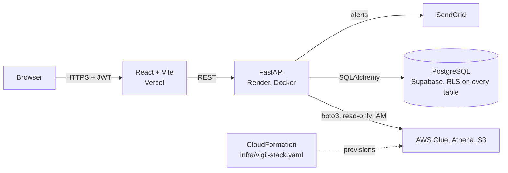

# Vigil

**ETL observability for AWS Glue: real-time monitoring, anomaly detection, and alerting, on a security foundation built like an internal tool would need.**

[](https://github.com/kymanirjarrett/vigil/actions/workflows/ci.yml)
[](LICENSE)


**Live demo:** [vigil-three-amber.vercel.app](https://vigil-three-amber.vercel.app/) · **API docs:** [vigil-59y0.onrender.com/docs](https://vigil-59y0.onrender.com/docs)

> Sign up to explore as an Analyst in demo mode. The API runs on Render's free tier and sleeps when idle, so the first request after a cold start can take about 30 seconds.

---

## Why

AWS Glue jobs fail quietly. Usually the first sign is a downstream user noticing stale data, hours after the job actually broke. CloudWatch has the raw signal, but turning it into something a team can watch takes real work. Vigil puts every Glue job on one dashboard, flags runs that look wrong, and emails someone before the failure cascades downstream.

## Features

**Monitoring**
- Live dashboard of every Glue job in the account, with latest status and worker configuration
- Per-job run history with duration charts and status badges
- Anomaly detection that flags duration spikes (more than 2 standard deviations above the job's mean run time) and consecutive failure streaks
- One-click anomaly scans with SendGrid email alerts, with every anomaly and alert stored for history
- Demo mode with realistic sample data, so the app is explorable without AWS access

**Security model**
- **Role-based access control.** Admin and Analyst roles map to granular permissions (`jobs:read`, `alerts:trigger`, `users:manage`, `audit:read`, and more), stored in the database and enforced server-side on every route. Analysts get read-only access by default.
- **Row-level security on every table.** RLS is enabled in the same Alembic migration that creates each table, with an explicit `service_role` policy, so a new table can't ship without it.
- **Append-only audit log.** Every significant action is recorded with the user, resource, IP address, and user agent. Rows are never updated or deleted.
- **Authentication hardening.** bcrypt password hashing, 15-minute JWT access tokens, rotating refresh tokens stored only as SHA-256 hashes, rate-limited login (5 per minute), and account lockout after repeated failures. Reusing a refresh token that was already rotated revokes every session for that user.
- **Two-factor authentication.** TOTP enrollment with one-time backup codes.
- **Threat detection.** Every login attempt is recorded, including attempts for emails that don't exist, which is what makes brute force (repeated failures against one account) and credential stuffing (failures spread across many accounts) detectable.
- **Security posture dashboard.** Hourly login successes and failures, the IPs with the most failures, open threat detections, users by role, and recent admin actions in one view. Users can also see their active sessions and sign any of them out.

## Architecture



The API checks permissions on every request through a single `require_permission` dependency, and every write that matters goes through `log_action`, so authorization and auditing live in one place instead of being repeated per route.

### Infrastructure as code

[`infra/vigil-stack.yaml`](infra/vigil-stack.yaml) provisions a real pipeline for Vigil to monitor: S3 buckets for input, output, scripts, and Athena results, a Glue database, table, job, and crawler, a Glue service role, and a read-only IAM policy for the backend. It deploys through a manual GitHub Actions workflow per environment, and `prod` requires an approval from a repository admin. See [`infra/README.md`](infra/README.md).

## Tech stack

| Layer | Technology |
|---|---|
| Frontend | React 19, Vite, React Router, Recharts |
| Backend | FastAPI, SQLAlchemy 2, Alembic, SlowAPI |
| Auth | python-jose (JWT), passlib (bcrypt), PyOTP |
| AWS | boto3 for Glue, Athena, and S3; CloudFormation |
| Database | PostgreSQL on Supabase |
| Email | SendGrid |
| Hosting | Vercel (frontend), Render via Docker (API) |
| Tooling | GitHub Actions, Husky, secretlint, ESLint, Ruff |

## Engineering practices

- **CI on every push and pull request:** Ruff and a compile check on the backend; ESLint, a production build, and `npm audit` (fails on high severity) on the frontend.
- **Secret scanning before every commit:** a Husky pre-commit hook runs secretlint on staged files, and a pre-push hook lints both apps.
- **Migrations only:** every schema change is an Alembic migration, and RLS ships in the same migration as the table.
- **Issue-driven workflow:** every pull request closes an issue (`Closes #N`).

## Run it locally

```bash
git clone https://github.com/kymanirjarrett/vigil.git
cd vigil
npm run setup            # installs both apps and the git hooks
npm run reveal-secrets   # creates backend/.env from backend/.env.example
```

Fill in `backend/.env`, then run each app in its own terminal:

```bash
npm run dev:backend    # FastAPI on :8000
npm run dev:frontend   # Vite on :5173
```

### Environment variables

| Variable | Purpose |
|---|---|
| `DATABASE_URL` | PostgreSQL connection string (Supabase session mode) |
| `VIGIL_JWT_SECRET` | Secret for signing JWTs (`openssl rand -hex 32`) |
| `VIGIL_ADMIN_EMAIL`, `VIGIL_ADMIN_PASSWORD` | Seeds the first Admin account |
| `AWS_ACCESS_KEY_ID`, `AWS_SECRET_ACCESS_KEY`, `AWS_REGION` | Read-only IAM user for Glue, Athena, and S3 |
| `GLUE_DATABASE_NAME`, `GLUE_TABLE_NAME`, `ATHENA_RESULTS_BUCKET` | Resources created by the CloudFormation stack |
| `SENDGRID_API_KEY`, `ALERT_SENDER_EMAIL` | Alert email delivery |
| `ALLOWED_ORIGINS` | Comma-separated CORS origins |

## Project structure

```
vigil/
├── backend/
│   ├── routers/          auth, totp, admin, glue, anomalies, alerts, history,
│   │                     audit, auth_events, auth_anomalies, security, mode, health
│   ├── alembic/          migrations (RLS enabled per table)
│   ├── permissions.py    RBAC: role to permission mapping and require_permission
│   ├── audit.py          append-only audit logging
│   ├── auth_detection.py brute force and credential stuffing detection
│   └── main.py
├── frontend/src/components/   dashboard, admin, audit, security, and account pages
├── infra/                     CloudFormation stack, Glue script, seed data
├── .github/workflows/         CI, CloudFormation deploy, database keep-alive
└── .husky/                    pre-commit secret scan, pre-push lint
```

## Roadmap

- Backend and frontend test suites, run in CI
- Keyless AWS authentication for the deploy workflow through GitHub OIDC
- CloudWatch metrics for Lambda and Glue
- Slack alerting and per-job anomaly sensitivity
- Step Functions monitoring

## License

[MIT](LICENSE) © 2026 Kymani Jarrett
